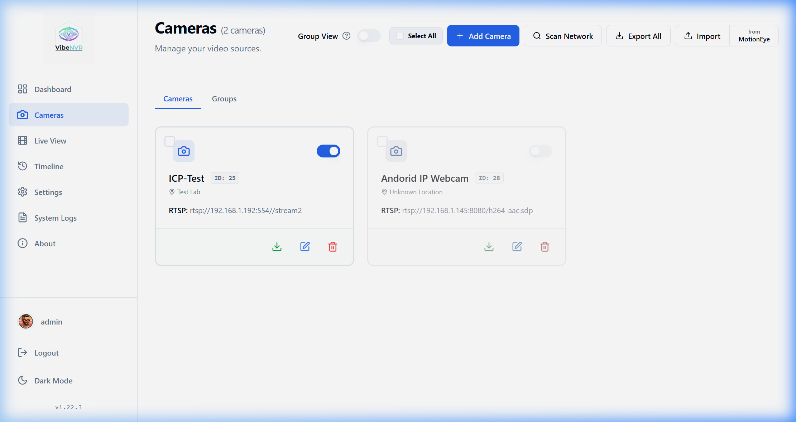
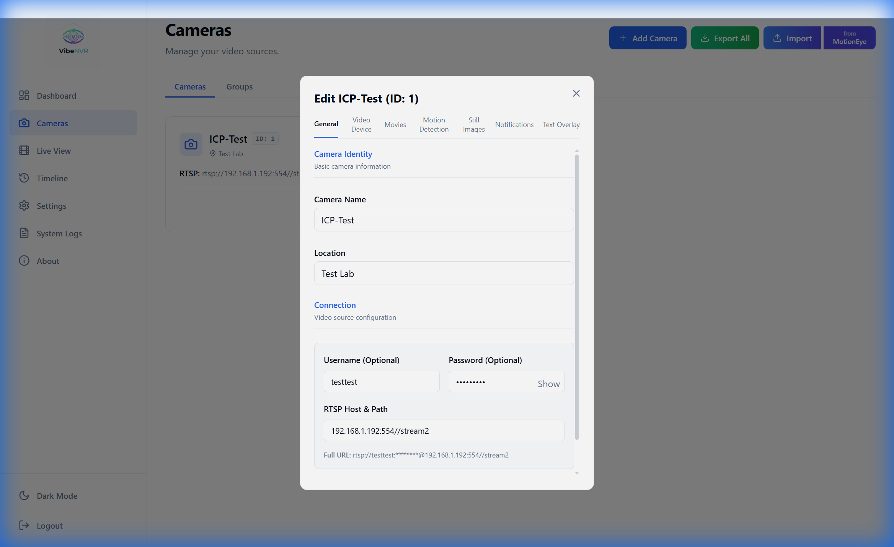
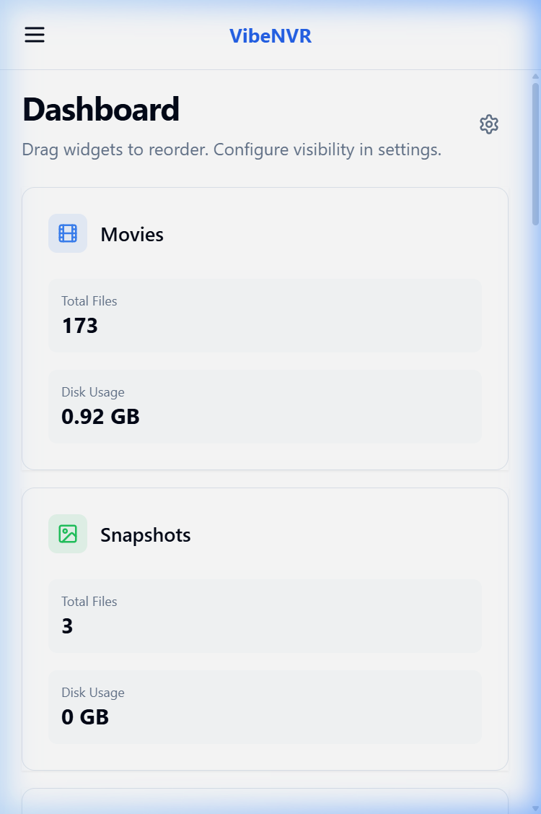
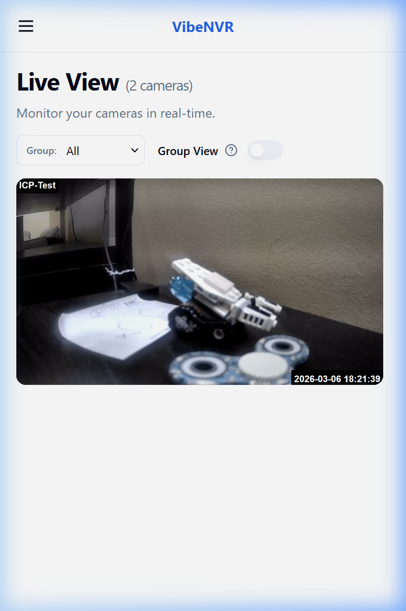
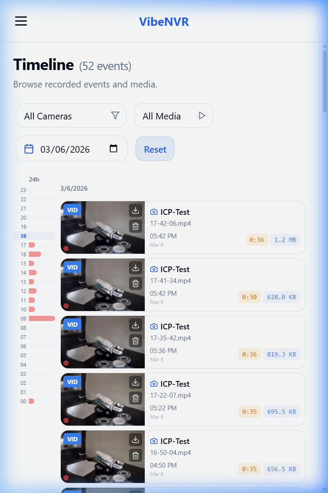

<p align="center">
  
</p>

# 📹 VibeNVR – Modern Video Surveillance System

VibeNVR is a modern, modular, and containerized video surveillance system designed to manage IP cameras, recordings, motion detection, and a unified event timeline. It features a custom high-performance video engine (VibeEngine) built for efficiency and reliability, wrapped in a premium React-based interface.

### 🎬 Video Demo


> **Project Status**: This is a **Vibe Coding Project**. Extensive testing has been performed to ensure stability, but we are always **open to new help** and contributions from the community!
> 
> ⚠️ **IMPORTANT**: When updating, always check the **[Release Notes](https://github.com/spupuz/VibeNVR/releases)** and ensure your `docker-compose.prod.yml` and `.env` are synchronized with the latest version.
> 
> **Language Policy**: Please note that **English is the official and only supported language** of this project. All code, user interface elements, commit messages, issues, and documentation (including wikis) must be written strictly in English to maintain consistency and accessibility for the global community.
> 
> ---
> ### 💬 Help Us Improve!
> We are building VibeNVR to be the best local NVR experience, and we can't do it without you. 
> 
> **Found a bug? Have a great idea for a feature? Want to share your setup?**
> Please **[Open an Issue](https://github.com/spupuz/VibeNVR/issues)**! We are extremely proactive, always available to fix problems, and love adding new capabilities requested by the community. Your feedback is what drives this project forward.


---
## ⚠️ Beta Disclaimer

This software is currently in active beta development. The database schema is still evolving and may undergo changes. While we strive for backward compatibility, manual database cleanup or migration steps might be required when updating to newer versions.

---

## ✨ Key Features

| Feature | Description |
|---------|-------------|
| 🖥️ **Modern Web Interface** | Ultra-premium UI built with React, Vite, and Lucide icons. |
| 🎨 **Customizable Dashboard** | Toggle widgets and graphs to suit your monitoring needs. |
| 🛡️ **Secure by Design** | Full JWT authentication, **2FA with Trusted Devices**, Rate Limiting, and HttpOnly Media Cookies. |
| 📷 **Advanced Video Engine** | Custom Python engine using OpenCV & FFmpeg for RTSP streaming and processing. |
| ⚡ **Passthrough Recording** | Direct Stream Copy support for near-zero CPU usage recording (experimental, with auto-fallback). |
| 🎯 **Smart Motion Detection** | Native motion detection with adjustable sensitivity, gap, and pre/post-capture buffers. |
| 📅 **Event Timeline** | Unified browser for movie recordings and high-res snapshots with instant filters. |
| 🔑 **API Access Tokens** | Secure, read-only API tokens with **TTL (Expiration)** and hashed storage for 3rd party integrations. |
| 💾 **Storage Management** | Automated background cleanup (FIFO) and **Bulk Deletion** tools. |
| 📁 **Camera Groups** | Organize cameras into custom groups for logical multi-view management. |
| 🕙 **Timezone Synchronization** | Full ISO 8601 support ensures perfect timing between engine, backend, and UI. |
| 📊 **Real-time Monitoring** | Live view with adaptive frame polling and dynamic MJPEG stream proxying. |
| 🐳 **Dockerized** | Zero-dependency deployment using Docker Compose. |

---

## 🔒 Security & Architecture

VibeNVR is built with security as a priority. For detailed information regarding our security model, authenticated media, internal port protection, vulnerability reporting, and Role-Based Access Control (RBAC), please see our dedicated [Security Documentation](SECURITY.md).

---

### 📊 Public Telemetry
VibeNVR maintains a public, anonymous telemetry dashboard where you can see global usage statistics, active versions, and hardware trends:
**[View Public Telemetry Dashboard](https://vibenvr-telemetry.spupuz.workers.dev/)**

### What is collected?
We only collect **non-sensitive, anonymous** technical data:
- **Application Version**: To see how many users are on the latest release.
- **Hardware Profile**: CPU count, total RAM (rounded to GB), and GPU acceleration status.
- **Usage Metrics**: Total number of cameras, camera groups, and events in the database.
- **System Info**: Operating System and hardware architecture (e.g., Linux x86_64).
- **Anonymous ID**: A randomly generated UUID that uniquely identifies the installation without linking it to any personal identity or IP address.
- **Feature Flags**: A simple indicator if notifications are configured (no addresses or tokens).

### How often?
The report is sent once **30 seconds after startup** and then **once every 24 hours**.


### Opt-out
Your privacy is paramount. You can disable telemetry at any time:
1. Navigate to **Settings** in the web interface.
2. Open the **Privacy & Analytics** section.
3. Toggle off **Enable Anonymous Telemetry** and save.

---

---

## 🚀 Quick Start

### Prerequisites
- Docker & Docker Compose (V2 recommended)

### 📦 Installation via Docker (Recommended)

1.  **Get the files**:
    Download the **[docker-compose.prod.yml](docker-compose.prod.yml)** file.
    
    *Alternatively, clone the repository to get all files (recommended for easier updates):*
    ```bash
    git clone https://github.com/spupuz/VibeNVR.git
    cd VibeNVR
    ```

2.  **Configuration (.env)**:
    VibeNVR is configured using a `.env` file. 
    
    *   If you cloned the repo, you can use the included `.env` file as a base.
    *   If you just downloaded the compose file, create a file named `.env` in the same directory.
    
    **Important: Update your `.env` with secure values:**
    ```properties
    # .env content example
    # ENV Configuration
    SECRET_KEY=change_this_to_a_long_random_string  # CRITICAL: Security key. Must be set and identical on all services.
    WEBHOOK_SECRET=change_this_to_a_long_random_string # REQUIRED: Validates engine->backend communication. Set SAME as SECRET_KEY.
    # POSTGRES_PASSWORD=vibenvrpass

    # Storage & Paths
    # VIBENVR_DATA=./viben_data             # Where recordings and logs are stored
    # VIBENVR_DB_DATA=./viben_db_data       # Database persistence path

    # Ports
    # VIBENVR_FRONTEND_PORT=8080            # Frontend Access Port
    # VIBENVR_BACKEND_PORT=5005             # Backend API Port

    # Hardware Acceleration
    # HW_ACCEL=true                         # Enable Hardware Acceleration (true/false)
    # HW_ACCEL_TYPE=auto                    # auto, nvidia, intel, amd
    ```
    *See the `.env` file in the repo for all available options.*

3.  **Start the service**:
    ```bash
    docker compose -f docker-compose.prod.yml up -d
    ```

### 🔄 Updating VibeNVR 
When a new version is released, follow these steps to ensure a clean update:

1. **Back up your .env file**:
   ```bash
   cp .env .env.bak
   ```

2. **Retrieve the new production compose file**:
   Ensure you are in the project root.
   ```bash
   curl -O https://raw.githubusercontent.com/spupuz/VibeNVR/main/docker-compose.prod.yml
   ```

3. **Pull the new images**:
   ```bash
   docker compose -f docker-compose.prod.yml pull
   ```

4. **Stop the current stack**:
   ```bash
   docker compose -f docker-compose.prod.yml down
   ```

5. **Start the new stack**:
   ```bash
   docker compose -f docker-compose.prod.yml up -d
   ```

---

## 💾 Data Persistence (Bind Mounts vs Volumes)

The default configuration above uses **Bind Mounts** (mappings to local folders like `./data/recordings`) which makes it easy to access your video files directly from the host system.

**Option A: Using Local Folders (Bind Mounts - Recommended)**
This allows you to easily backup or view recordings using tools on your host machine.
- Recordings: `./data/recordings`
- Database: `./data/db`

**Option B: Using Docker Volumes**
If you prefer to let Docker manage storage (better for performance on some non-Linux filesystems), change the `volumes` section in `docker-compose.yml`:

```yaml
volumes:
  - vibenvr_data:/data
```

And define the volume at the end of the file:
```yaml
volumes:
  vibenvr_data:
```

---

---

## 🏠 Dashboard Integration (Homepage)

VibeNVR integrates perfectly with [gethomepage.dev](https://gethomepage.dev/) using the `customapi` widget.

**Example `services.yaml` configuration:**

```yaml
- VibeNVR:
    icon: mdi-cctv
    href: http://your-vibenvr-ip:8080/
    description: Video Surveillance
    server: your-docker-host # Optional: Requires docker socket access in Homepage
    container: vibenvr-backend
    widget:
      type: customapi
      url: http://your-vibenvr-ip:8080/api/v1/homepage/stats
      headers:
        X-API-Key: "your-api-token-here"
      method: GET
      mappings:
        - field: cameras_online
          label: Online
        - field: events_today
          label: Events (24h)
        - field: storage_used_gb
          label: Storage (GB)
        - field: uptime
          label: Uptime
        - field: cameras_recording
          label: Recording
        - field: storage_total_gb
          label: Total Disk (GB)
```

---

## 🌐 Production Deployment (Nginx Proxy Manager)

Since VibeNVR binds to `127.0.0.1` by default, you **MUST** use a Reverse Proxy to access it from other computers or the internet.

**Recommended Setup with Nginx Proxy Manager (NPM):**

1.  **Network Setup**: Ensure NPM and VibeNVR containers can talk to each other. The easiest way is to put them on the same Docker network, or point NPM to the host IP (`host.docker.internal` or gateway IP).
2.  **Proxy Host Configuration**:
    - **Domain Names**: Set up your domain (e.g., `nvr.yourdomain.com`).
    - **Scheme**: `http`
    - **Forward Host**: `vibenvr-frontend` (if on same network) or Your Host LAN IP.
    - **Forward Port**: `80` (container port) or `8080` (host mapped port).
3.  **Websockets Support**: Enable "Websockets Support" in NPM for live streaming stability.
4.  **SSL**: Enable "Force SSL" and strictly use Let's Encrypt certificates.

**Why this is safer?**
Attackers scanning your public IP will find all ports (5000, 8000) closed. They can only access the NVR through port 80/443 via your Proxy, which enforces HTTPS and potentially extra authentication layers.

---

## 🔧 Troubleshooting

### Permission Errors on Proxmox/PVE Kernel, OpenMediaVault, Synology, QNAP

If you're running VibeNVR on a system with the **Proxmox kernel (pve-kernel)**, **OpenMediaVault**, **Synology**, **QNAP**, or similar NAS devices, you may encounter permission errors like:

**PostgreSQL errors:**
```
could not create Unix socket for address "/var/run/postgresql/.s.PGSQL.5432": Permission denied
FATAL: could not create any Unix-domain sockets
```

**Engine/Backend errors:**
```
socket.socketpair()
PermissionError: [Errno 13] Permission denied
```

**Solution:** These errors are caused by kernel security restrictions (seccomp/AppArmor). Try the following solutions in order:

**Option 1: Disable seccomp and AppArmor**

Add these lines to **each service** (backend, engine, db) in your `docker-compose.yml`:

```yaml
security_opt:
  - seccomp:unconfined
  - apparmor:unconfined
```

**Option 2: Use Privileged Mode for ALL Containers**

> ⚠️ **CRITICAL WARNING**: Running containers in privileged mode bypasses Docker's isolation and grants root-level access to the host machine. Only use this if absolutely necessary on specific problematic kernels (like older Proxmox/OMV) and ensure your system is well-segmented.

If Option 1 doesn't work (common on OpenMediaVault + Proxmox kernel), you MUST change `privileged: false` to `privileged: true` for **every service** (frontend, backend, engine, db) in your `docker-compose.yml`:

```yaml
services:
  frontend:
    privileged: true # Change from false to true
  backend:
    privileged: true # Change from false to true
  engine:
    privileged: true # Change from false to true
  db:
    privileged: true # Change from false to true
```

**Option 3: System-level fix** (if all else fails)

```bash
# Enable unprivileged user namespaces
sudo sysctl -w kernel.unprivileged_userns_clone=1

# Make it permanent
echo "kernel.unprivileged_userns_clone=1" | sudo tee /etc/sysctl.d/99-userns.conf
sudo sysctl --system

# Restart Docker
sudo systemctl restart docker
```

After making changes, restart the containers:
```bash
docker compose down
docker compose up -d
```

---

## 📸 Screenshots

### Desktop Views

| Login | Dashboard |
|:-----:|:---------:|
|  |  |

| Cameras | Camera Settings |
|:-------:|:---------------:|
|  |  |

| Live View | Timeline |
|:---------:|:--------:|
|  |  |

| Settings |
|:--------:|
|  |

### 📱 Mobile Views

| Dashboard | Live View | Timeline |
|:---------:|:---------:|:--------:|
|  |  |  |

## 🧱 Architecture

VibeNVR is split into four main microservices:

*   **Frontend**: React-based SPA providing a sleek, responsive dashboard.
*   **Backend**: FastAPI server handling logic, secure database access, and **secure HttpOnly cookie-based media relay**.
*   **VibeEngine**: Custom processing engine for motion detection, recording, and overlays using OpenCV.
*   **Database**: PostgreSQL for persistent storage of camera configs and events.

---

## 🌟 Support & Star History

<p align="center">
  If you find VibeNVR useful, please consider giving it a star or buying me a coffee! Your support helps me maintain and improve the project.
  <br>
  <br>
  <a href="https://www.buymeacoffee.com/spupuz" target="_blank">
    
  </a>
  <br>
  <br>
  <a href="https://www.producthunt.com/products/vibenvr?embed=true&utm_source=badge-featured&utm_medium=badge&utm_campaign=badge-vibenvr" target="_blank" rel="noopener noreferrer">
    
  </a>
  <br>
  <br>
  <a href="https://star-history.com/#spupuz/VibeNVR&Date">
    
  </a>
</p>

---


## 📄 License

This project is open source and available under the [MIT License](LICENSE).

**DISCLAIMER**: THE SOFTWARE IS PROVIDED "AS IS", WITHOUT WARRANTY OF ANY KIND, EXPRESS OR IMPLIED, INCLUDING BUT NOT LIMITED TO THE WARRANTIES OF MERCHANTABILITY, FITNESS FOR A PARTICULAR PURPOSE AND NONINFRINGEMENT. IN NO EVENT SHALL THE AUTHORS OR COPYRIGHT HOLDERS BE LIABLE FOR ANY CLAIM, DAMAGES OR OTHER LIABILITY, WHETHER IN AN ACTION OF CONTRACT, TORT OR OTHERWISE, ARISING FROM, OUT OF OR IN CONNECTION WITH THE SOFTWARE OR THE USE OR OTHER DEALINGS IN THE SOFTWARE.

---

<p align="center">
  Made with ❤️ by <a href="https://github.com/spupuz">spupuz</a>
</p>

