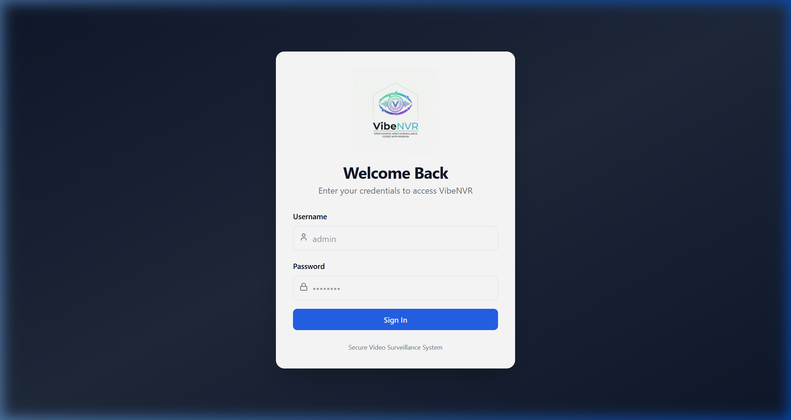
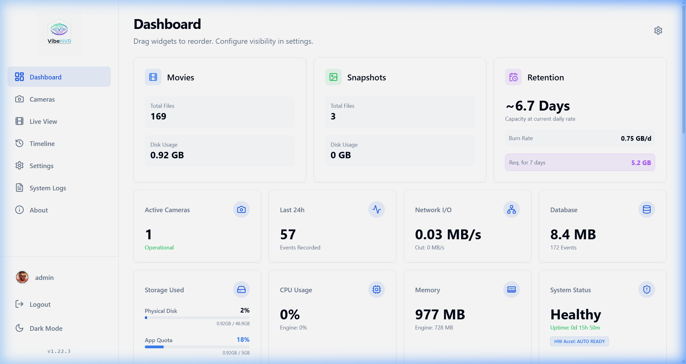
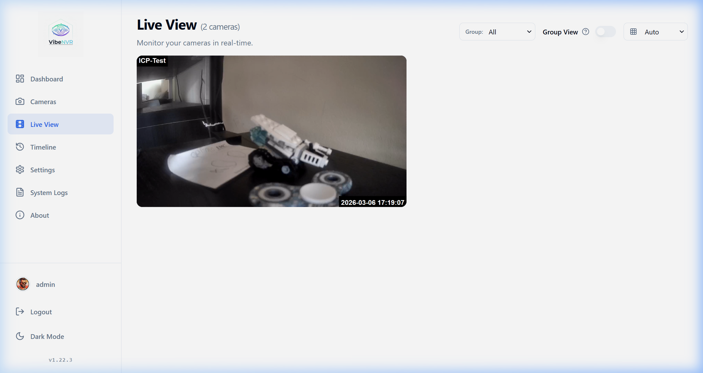
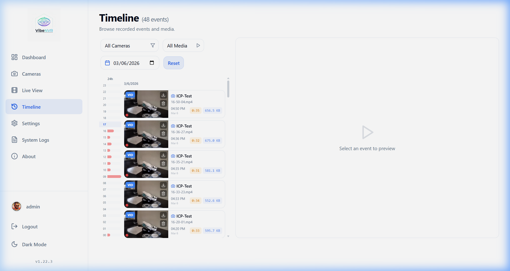
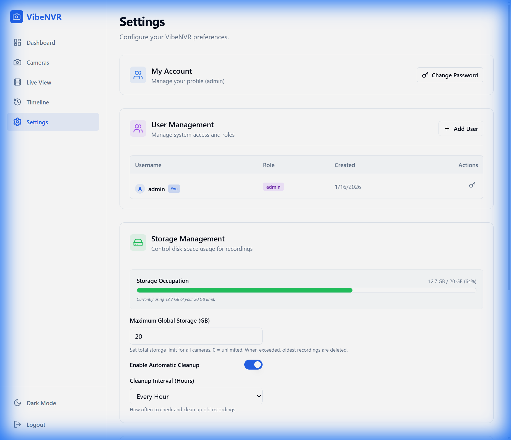
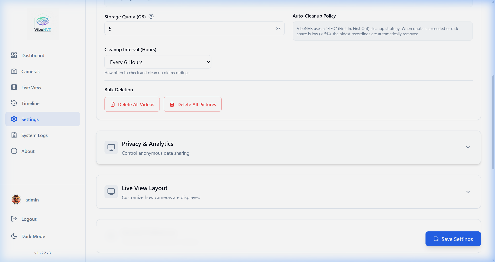

# 📹 VibeNVR – Modern Video Surveillance System

VibeNVR is a modern, modular, and containerized video surveillance system designed to manage IP cameras, recordings, motion detection, and a unified event timeline. It features a custom high-performance video engine (VibeEngine) built for efficiency and reliability, wrapped in a premium React-based interface.

---
## ⚠️ Beta Disclaimer

This software is currently in active beta development. The database schema is still evolving and may undergo changes. While we strive for backward compatibility, manual database cleanup or migration steps might be required when updating to newer versions.

---

## ✨ Key Features

| Feature | Description |
|---------|-------------|
| 🖥️ **Modern Web Interface** | Ultra-premium UI built with React, Vite, and Lucide icons. |
| 🎨 **Customizable Dashboard** | Toggle widgets and graphs to suit your monitoring needs. |
| 🛡️ **Secure by Design** | Full JWT authentication for API, streams, and static media. No unauthorized access. |
| 📷 **Advanced Video Engine** | Custom Python engine using OpenCV & FFmpeg for RTSP streaming and processing. |
| 🎯 **Smart Motion Detection** | Native motion detection with adjustable sensitivity, gap, and pre/post-capture buffers. |
| 📅 **Event Timeline** | Unified browser for movie recordings and high-res snapshots with instant filters. |
| 💾 **Storage Management** | Automated background cleanup (FIFO) and **Bulk Deletion** tools. |
| 📁 **Camera Groups** | Organize cameras into custom groups for logical multi-view management. |
| 🕙 **Timezone Synchronization** | Full ISO 8601 support ensures perfect timing between engine, backend, and UI. |
| 📊 **Real-time Monitoring** | Live view with adaptive frame polling and dynamic MJPEG stream proxying. |
| 🐳 **Dockerized** | Zero-dependency deployment using Docker Compose. |

---

## 🔒 Security & Architecture

VibeNVR is built with security as a priority. Recent updates have hardened the system considerably:

1.  **Authenticated Media**: Static files (videos/snapshots) are **NOT** served publicly. All media access requires a valid JWT token, passed either via Headers or securely signed Query Parameters.
2.  **Protected Internal Ports**: By default, the Backend (5000) and Engine (8000) bind only to `127.0.0.1`. They are **NOT** accessible from the outside world, preventing direct attacks on the API or streams.
3.  **Reverse Proxy Ready**: The system is designed to sit behind a Reverse Proxy (like Nginx Proxy Manager) which handles SSL termination and external access.

---

## 🚀 Quick Start

### Prerequisites
- Docker & Docker Compose (V2 recommended)

### 📦 Installation via Docker (Recommended)

1.  Download the **[docker-compose.prod.yml](docker-compose.prod.yml)** file.
    
    *Alternatively, clone the repository to get all files:*
    ```bash
    git clone https://github.com/spupuz/VibeNVR.git
    cd VibeNVR
    ```

2.  **Configuration**:
    Open the file and optionally update:
    - `POSTGRES_PASSWORD`: Set a strong password.
    - `SECRET_KEY`: Generate a secure random string (crucial for auth).
    - `HW_ACCEL`: Set to `true` if you have a GPU (check comments in file for device mapping).

3.  Start the service:
    ```bash
    docker compose -f docker-compose.prod.yml up -d
    ```

---

## 💾 Data Persistence (Bind Mounts vs Volumes)

The default configuration above uses **Bind Mounts** (mappings to local folders like `./data/recordings`) which makes it easy to access your video files directly from the host system.

**Option A: Using Local Folders (Bind Mounts - Recommended)**
This allows you to easily backup or view recordings using tools on your host machine.
- Recordings: `./data/recordings`
- Database: `./data/db`

**Option B: Using Docker Volumes**
If you prefer to let Docker manage storage (better for performance on some non-Linux filesystems), change the `volumes` section in `docker-compose.yml`:

```yaml
volumes:
  - vibenvr_data:/data
```

And define the volume at the end of the file:
```yaml
volumes:
  vibenvr_data:
```

---

## 🌐 Production Deployment (Nginx Proxy Manager)

Since VibeNVR binds to `127.0.0.1` by default, you **MUST** use a Reverse Proxy to access it from other computers or the internet.

**Recommended Setup with Nginx Proxy Manager (NPM):**

1.  **Network Setup**: Ensure NPM and VibeNVR containers can talk to each other. The easiest way is to put them on the same Docker network, or point NPM to the host IP (`host.docker.internal` or gateway IP).
2.  **Proxy Host Configuration**:
    - **Domain Names**: Set up your domain (e.g., `nvr.yourdomain.com`).
    - **Scheme**: `http`
    - **Forward Host**: `vibenvr-frontend` (if on same network) or Your Host LAN IP.
    - **Forward Port**: `80` (container port) or `8080` (host mapped port).
3.  **Websockets Support**: Enable "Websockets Support" in NPM for live streaming stability.
4.  **SSL**: Enable "Force SSL" and strictly use Let's Encrypt certificates.

**Why this is safer?**
Attackers scanning your public IP will find all ports (5000, 8000) closed. They can only access the NVR through port 80/443 via your Proxy, which enforces HTTPS and potentially extra authentication layers.

---

## 📸 Screenshots

### Login


### Dashboard


### Live View


### Timeline


### Settings & Bulk Delete



## 🧱 Architecture

VibeNVR is split into four main microservices:

*   **Frontend**: React-based SPA providing a sleek, responsive dashboard.
*   **Backend**: FastAPI server handling logic, secure database access, and **authenticated media relay**.
*   **VibeEngine**: Custom processing engine for motion detection, recording, and overlays using OpenCV.
*   **Database**: PostgreSQL for persistent storage of camera configs and events.

---

## 📄 License

This project is open source and available under the [MIT License](LICENSE).

---

<p align="center">
  Made with ❤️ by <a href="https://github.com/spupuz">spupuz</a>
</p>
